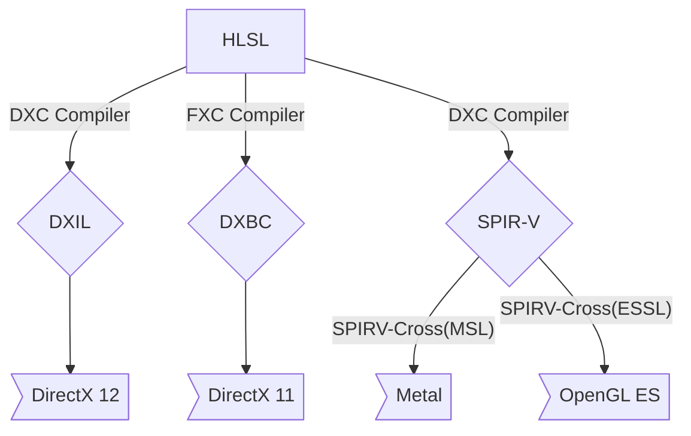

```mermaid
graph TD
    A[HLSL] -->|DXC Compiler| B{DXIL}
    A -->|FXC Compiler| C{DXBC}
    A -->|DXC Compiler| D{SPIR-V}
    D -->|"SPIRV-Cross(MSL)"| I>Metal]
    D -->|"SPIRV-Cross(ESSL)"| J>OpenGL ES]
    B --> G>DirectX 12]
    C --> H>DirectX 11]
```